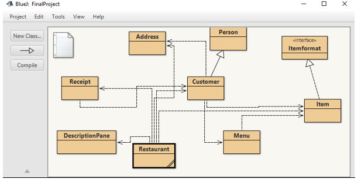
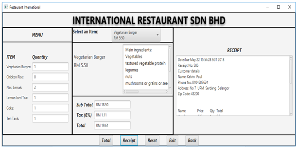
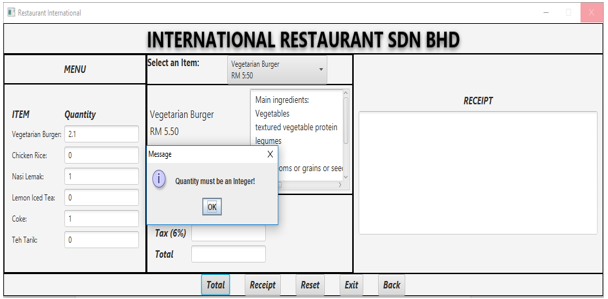

# Restaurant-Ordering-System
##This is a two person project for my introduction to Java programming course in my second semester. We had to include all that we learnt during the semester including but not limited to **Object Oriented Programming (inheritance, polymorphism, abstract and interface classes) and file management.**

The GUI was develped using **JAVAFX**

### Description of the project 

**An Item class will implement methods the Itemformat interface (getName () and getPrice()), that is to say that every item will have a name and price. The Menu class has 1 or more Item (Composition relationship) and quantity. To compute the TotalPrice for one Item (Item price * quantity)**

**The Address class has all the attribute of an address (house number, street, city, state and zip code) while Person class has the attribute of a person (First name and last name). A customer has an address which can be shared by other customers (Aggregation relationship) and will inherit all the attributes of a person (Inheritance relationship) in addition to have phone number **

**Many Customers can order from one menu. When a customer makes an order, the item name, price and quantity are added to the customer. To calculate the subtotal, sum up the TotalPrice of all Item the customer ordered. The tax is calculated (subtotal * 0.06) and the total amount due is determined by adding the subtotal and tax.**

**One customer can generate many receipt (Association) but each receipt will have a unique receipt number, date and time the receipt was created. The receipt will be able to display the Customer information and all item ordered, the subtotal, tax and total amount due**

### Sample output

